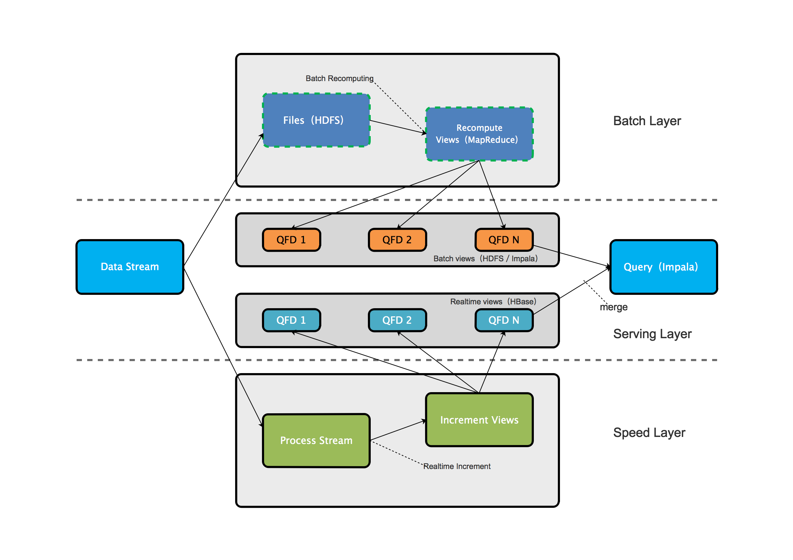
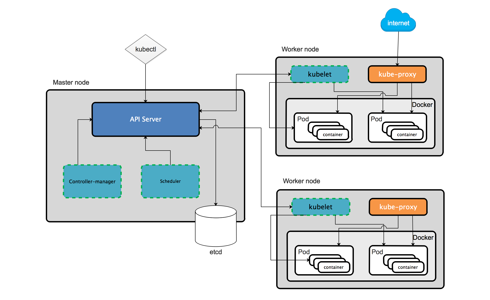
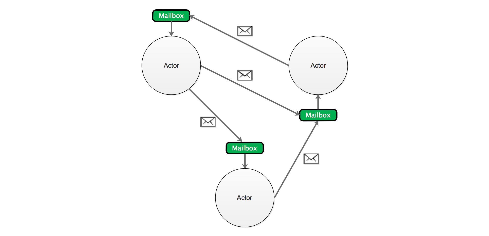
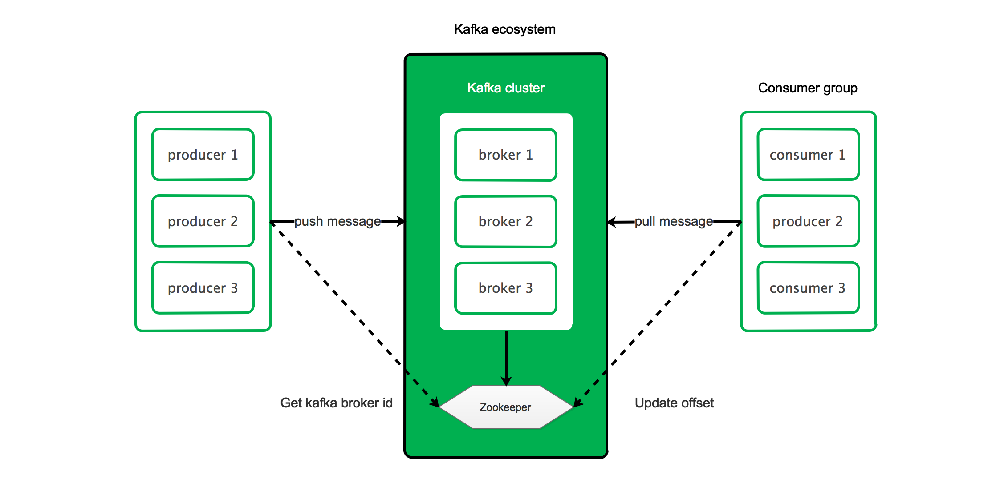
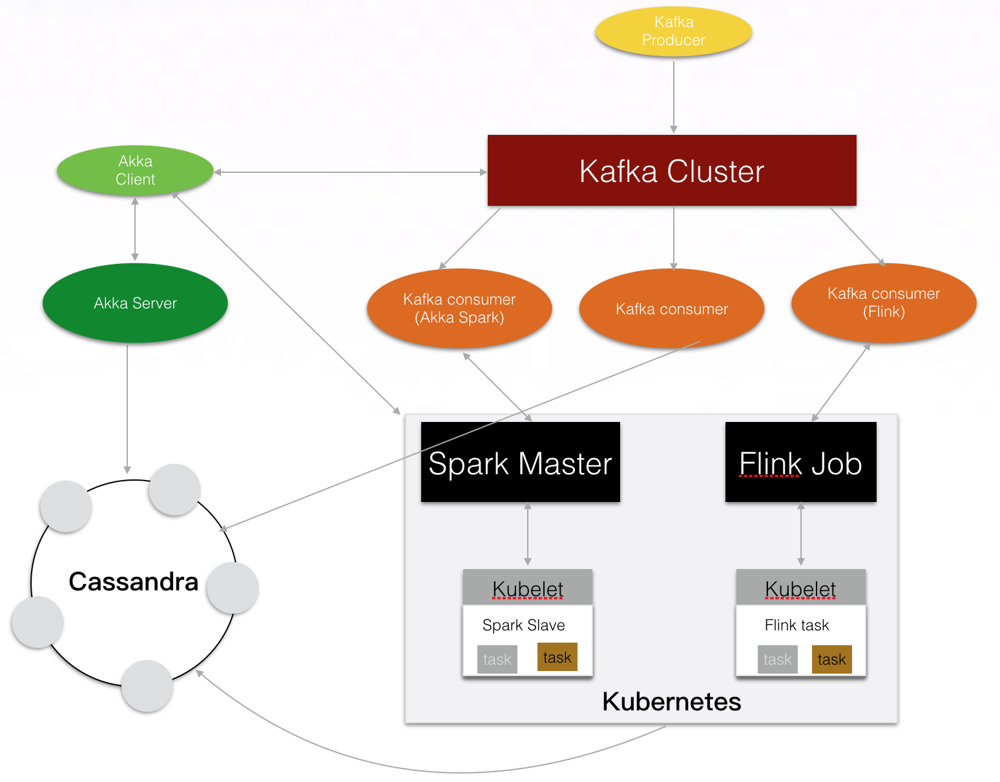

# [云框架]SMACK大数据架构

跟硅谷大数据工程师谈笑风声？Spark、Storm、Pig、Hive……还是Hadoop？大数据技术前沿公司会告诉你——**SMACK** is the new buzzword！SMACK并非单一技术，而是由Spark、Mesos、Akka、Cassandra、Kafka组成的大数据架构，适用于广泛的数据处理场景，可完成低延迟扩展及数据复制、统一管理异构负载集群，并通过单一平台满足不同架构设计和不同应用的需求。（[A Brief History of the SMACK Stack](https://chiefscientist.org/a-brief-history-of-the-smack-stack-f382547e91fe)）

在面对数据源数量急剧增加、数据样本获取难度升高、数据分析时效性差、数据分析投资回报率低等一系列挑战时，SMACK可以解决Hadoop等熟知技术无法解决的诸多问题，特别是物联网化、API化趋势下big data向[fast data](http://www.infoworld.com/article/2608040/big-data/fast-data--the-next-step-after-big-data.html)转变所带来的新需求，以及对于[Data Pipeline](http://www.toadworld.com/platforms/oracle/w/wiki/11576.modern-data-pipeline-architectures)的依赖。

更深入的讲，SMACK可以看作是一种广义上的框架组合思想，其中技术可以增加或被更适合的技术替代，以便我们更好的完成大数据处理。本篇[云框架](README.md)即在引擎层增加了**Flink用于处理实时数据**，并**使用Kubernetes替换Mesos作为容器层**，以海量网站数据为例，提供SMACK大数据框架的最佳实践，包括数据接入、SMACK核心、数据分析等一整套框架内容。

# 内容概览

* [快速部署](#快速部署)
* [背景说明](#背景说明)
    * [关于Fast Data](#fast-data)
    * [关于Data Pipeline](#data-pipeline)
    * [关于Lambda Architecture](#lambda-architecture)  
* [框架说明-业务](#框架说明-业务)
* [框架说明-SMACK核心](#smack核心)
    * [引擎-Spark](#引擎-spark)
    * [引擎-Flink](#引擎-flink)
    * [容器-Kubernetes](#容器-kubernetes)
    * [模型-Akka](#模型-akka)
    * [存储-Cassandra](#存储-cassandra)
    * [消息队列-Kafka](#消息队列-kafka)
    * [Data Pipeline](#data-pipeline)
* [框架说明-数据接入](#数据接入)
* [框架说明-数据分析与监控](#数据分析与监控)
* [更新计划](#更新计划)
* [社群贡献](#社群贡献)

# 快速部署

# 背景说明

在学习和使用SMACK业务和框架之前，需要我们了解`Fast Data`、`Data Pipeline`、`Lambda Architecture`，这三点可以算得上是SMACK的灵魂，也是我们选择使用SMACK而不是Hadoop等其他技术的重要原因。

## 关于Fast Data

客观的说，我们需要数据分析，但业务不一定真的会产生“足够大量”的数据，我们实际上更需要的是“快速的数据”，即**Fast Data**，以拉近与客户之间的距离、快速响应需求并提供个性化产品和服务。

Fast Data的核心在于“**让正确的信息在正确的时间通过正确的设备传递给正确的人**”，需要满足以下三点标准——

* **快速摄入（fast ingestion）**：摄取的目的在于获取数据源接口，以便进行更改并统一输入数据，分为直接摄入（direct ingestion，系统模块直接hook API generation，优点是简单，缺点是不灵活）和消息队列（message queue，通过broker访问数据生成API，优点是可以分区、复制、排序、根据组件压力管理pipeline）
* **流分析（analysis streaming）**：大量fast data导致流分析从后端转移到了流层，流分析能力对于实时处理非常重要
* **逐个事件处理（per event transaction）**：实时的逐个事件处理会产生巨大价值，例如节省将数据存储在磁盘上的成本、帮助业务实时作出决策（如何在pre event transcation上提取并获取价值也已成为现代大数据工程师的一大挑战，目前较为流行的是通过机器学习工具处理流数据）

## 关于Data Pipeline

数据传递包括多个步骤，从复制数据到将数据从现有位置传递到云端，从重新格式化数据到数据源之间的联通。过去，这些步骤常需要不同工具来完成。而Data Pipeline则是这些步骤自动化的总和，保证这些步骤可以可靠的应用于所有数据。

Data Pipeline遵循的策略和原则如下——

* **异步消息传递（asynchronous message passing）**：Actor向进程（或actor）发送消息，并依赖进程和支持系统来选择并调用代码运行（Akka、Kafka、Spark相关）
* **[一致性算法](https://en.wikipedia.org/wiki/Consensus_algorithm)及[gossip protocol](https://en.wikipedia.org/wiki/Gossip_protocol)（consensus and gossip）**：（Akka、Cassandra相关）
* **数据局部性（data locality）**：分为temporal（时间序，短时间内数据复用）和Spatial（空间序，在相近存储位置使用数据）（Cassandra、Kafka相关）
* **故障探测（failure detection）**：Kafka中consumer注册成功后，coordinator将consumer添加到ping request scheduler的队列中，并尝试跟踪consumer是否仍然存在；Cassandra在本地确定node是up或down状态，本根据信息协调client访问；在Akka和Spark中使用网络变量相关的三个spark属性（`spark.akka.heartbeat.pauses`、`spark.akka.failure-detector.threshold`、`spark.akka.heartbeat.interval`）进行故障检测。（Cassandra、Spark、Akka、Kafka相关）
* **容错／无单节点故障（fault tolerance／no single point of failure）**：（Spark、Cassandra、Kafka相关）
* **隔离（isolation）**：（Spark、Cassandra、Kafka相关）
* **位置透明（location transparency）**：Spark、Cassandra、Kafka中，位置透明允许读写集群中的任何节点，而系统将读写信息复制到整个集群；在Akka中，actor的mailing address可以是路由位置，此位置对于开发者而言是透明的。（Akka、Spark、Cassandra、Kafka相关）
* **并行化（paralleism）**：Kafka分区并行；Cassandra数据并行；Spark和Akka任务并行；（Kafaka、Cassandra、Spark、Akka相关）
* **扩展分区（partition for scale）**：SMACK技术是网络拓扑感知的（Cassandra、Spark、Kafka、Akka相关）
* **故障点重播（replay for any point of failure）**：Spark中通过checkpointing实现，Kafka和Cassandra通过ZooKeeper实现，而Akka通过Akka persistence实现。（Spark、Cassandra、Kafka、Akka相关）
* **复制弹性（replicate for resiliency）**：Kafka通过调整服务器数量复制每个分区内的日志，集群内服务器发生故障时自动转移副本；Cassandra将副本存储在多个节点上以保障可靠性和容错；Spark通过HDFS实现；（Spark、Cassandra、Kafka相关）
* **可扩展的基础设施（Scalable infrastructure）**：（Spark、Cassandra、Kafka相关）
* **无共享架构（share nothing／masterless）**：节点独立（Cassandra、Akka相关）
* **Dynamo系统原则（Dynamo systems principles）**：Dynamo系统是一组技术，用来获得高可用性的键值分布式数据存储或结构化存储系，具有增量可扩展（incremental scalability）和对称性（symmetry）的特点。

## 关于Lambda Architecture

建立强大可扩展的大数据系统，需遵循Lambda Architecture的架构原则，服从`query = function(all data)`公式。

Lambda Architecture原则包括——

* **人为容错性（human fault-tolerance）** ：系统易数据丢失或数据损坏，大规模时可能是不可挽回的

* **数据不可变性（data immutability）** ：数据存储在它的最原始的形式不变的，永久的

* **重新计算（recomputation）** ：因为上面两个原则，运行函数重新计算结果是可能的

其**架构层次示例**如下：

* **批处理层（Batch Layer）**：批处理工具
* **服务层（Serving Layer）**：用于加载和现实数据库中的批处理视图，以便用户能够查询，不一定需要随机写，但是支持批更新和随机读
* **速度层（Speed Layer）**：处理新数据和服务层更新造成的高延迟补偿，利用流处理系统和随机read/write数据存储库来计算实时视图(HBase)

# 框架说明-业务

# 框架说明-SMACK核心

本项目框架整体结构如下:

基于Flink（Spark）、Kubernetes（Mesos）、Akka、Cassandra、Kafka这样的组合，利用其成熟的技术、易用性、组合自由性、自动化程度优势等特性去对应不同场景，所构建平台灵活性很难被击败。

**Flink、Kubernetes、Akka、Cassandra、Kafka比较复杂，本项目不做详细解读，仅对基本要点进行介绍以便理解SMACK大数据架构，更多内容建议通过官方文档进行具体学习。**

## 引擎-Spark

**使用Spark处理“Pull型”数据，即client可查询历史数据，如历史某一时段web访问量**

[Difference between Spark and Flink](https://stackoverflow.com/questions/28082581/what-is-the-difference-between-apache-spark-and-apache-flink)

Spark基于内存设计，采用分布式计算Master-Slave模型，支持包括Scala、Java、Python在内的多种语言，提供Map Reduce操作、SQL查询、流数据、机器学习和图表数据处理等多种能力。Spark并不是要取代Hadoop，二是为管理不同性质大数据用例的统一框架。

完整的Spark架构生态由Spark Core（核心API）及Spark SQL、Spark Streaming、Spark MLib、Spark Graphx等附加库构成。

**Spark Core**：Spark Core是大规模并行和分布式数据处理的基础引擎（Spark项目基础），负责内存管理和故障恢复、调度分发监控集群作业、与存储系统进行交互等。Spark采用RDD基础数据结构，可通过在外部存储系统中引用数据集（[Actions](http://spark.apache.org/docs/1.2.1/programming-guide.html#actions)）或通过在现有RDD转换（map、filter、reducer、join等）来创建（[Transformations](http://spark.apache.org/docs/1.2.1/programming-guide.html#transformations)）。

**Spark SQL**：Spark SQL通过JDBC API暴露Spark数据集，支持传统BI和可视化工具在Spark数据上执行SQL查询，同时对不同格式数据（JSON、Parquet、数据库等）执行ETL病暴露给特定查询。

**Spark Streaming**：Spark Streaming以微批量的方式计算和处理实时数据流，它使用DStream，简单来说就是一个弹性分布式数据集（RDD）系列，处理实时数据。

**Spark MLib**：Spark MLib（Machine Learning Library）是Spark可扩展的机器学习库，由二元分类、线性回归、聚类、协同过滤、梯度下降以及底层优化原语通用的学习算法和工具组成。

**Spark GraphX**：GraphX是用于图计算和并行图计算的Spark API，通过弹性分布式属性图（Resilient Distributed Property Graph）扩展Spark RDD。GraphX通过暴露基础操作符集合（如subgraph，joinVertices和aggregateMessages）和经过优化的Pregel API变体以支持图计算，并提供简化图分析任务的图算法和构建器集合。

**Read more [Apache Spark Official Documentation](https://spark.apache.org/docs/latest/)**

## 引擎-Flink

**使用Flink处理“push型”数据，即实时将数据推送给client**

[Difference between Spark and Flink](https://stackoverflow.com/questions/28082581/what-is-the-difference-between-apache-spark-and-apache-flink)

Flink是针对流数据和批数据（流数据的一种极限特例）的分布式处理引擎，采用Java编写，支持Scala、Java、Python的API。Flink的最大特点在于将所有任务当作“流”来处理，支持快速本地迭代及环形迭代任务。相比Spark，Flink并没有将内存完全交给应用层，由此降低了out of memory的发生（Spark在1.5版本后所有DataFrame操作直接作用于[Tungsten](https://community.hortonworks.com/articles/72502/what-is-tungsten-for-apache-spark.html)的二进制数据上）。

* Client将任务提交给JobManager，JobManager分发任务给TaskManager，TaskManager执行任务并向JobManager汇报任务状态（心跳） 
* TaskManager之间通过“流”来传递数据，TaskManager内部及TaskManager之间均有数据传递
* Flink允许多级Shuffle

Flink具备以下特性：

* 仅需少量配置即可实现高吞吐率和低延迟
* 通过Event Time简化乱序到达事件计算
* 通过checkpoint机制避免故障发生时状态受到影响
* 流式窗口（时间窗口、统计窗口、Session窗口、数据驱动窗口等）可通过灵活的触发条件定制
* Flink streaming运行时，慢的数据sink节点会backpressure快的数据源（sources）
* Flink的容错机制保证了系统在拥有高吞吐率的同时还能提供强一致性的保障
* 流处理和批处理基于同一个运行时（Flink Runtime）
* Flink在JVM实现了自己的内存管理
* Flink支持迭代计算和增量迭代
* [DataStream API](https://ci.apache.org/projects/flink/flink-docs-release-1.2/dev/datastream_api.html) & [DataSet API](https://ci.apache.org/projects/flink/flink-docs-release-1.2/dev/batch/index.html)
* Flink Stack

**Read more [Apache Flink Documentation](https://ci.apache.org/projects/flink/flink-docs-release-1.3/)**

## 容器-Kubernetes

Kubernetes是谷歌开源的自动化容器集群管理系统，在Docker基础上为容器化应用提供部署运行、资源调度、服务发现和弹性伸缩等功能特性，无需用户进行复杂的设置工作。轻量、易用、可拓展、自修复是Kubernetes的主要特点，也使得Kubernetes成为目前最为流行的容器编排工具，其架构如下：

**Master node**：Master node负责Kubernetes集群的管理，编排实际服务运行的节点，是所有管理任务的entry point。

* API server是用于控制集群的REST命令的entry point，处理并验证REST请求，执行绑定的业务逻辑，并将结果状态存储至etcd
* etcd作为配置中心和存储服务，保存所有组件的定义及状态，并支持Kubernetes多组件之间的交互
* scheduler是插件式调度器，主要用来监听etcd中的pod目录变更并分配node，同时调用API server的bind接口关联node和pod
* controller manager承担IaaS交互、node管理、pod管理及replication、service、namespace管理等master node主要功能，通过监听etcd、registry、event对应事件实现

**Worker node**：pod运行在worker node之上，负责管理容器间的网络、与主节点之间的通信及为容器分配资源等

* docker在worker node上运行，并执行配置的pod
* kubelet本身即是REST服务，和pod相关命令操作通过接口实现，负责容器管理、镜像管理、volume管理等任务，支持volume和network的扩展
* kube-proxy用于单个work node服务的网络代理及负载均衡，实现kubernetes的service机制（TCP和UDP流转发）
* kubectl与API service通讯的命令行工具，向master node发送命令

**Read more [Kubernetes Documentation](https://kubernetes.io/docs/home/)**

## 模型-Akka

Akka是基于Actor模型的并发框架，能够在JVM上简化并行和分布式应用的构建，具有很强的扩展性，可以在系统内轻松创建数千个实例，也能够便捷的从单一节点进程扩展到一个集群的机器中，无需修改代码即可远程运行失败恢复和错误处理。简单来说，Akka是用来开发容错、分布式、并发应用的框架。

* **Actor**是Akka的核心所在，指封装状态和行为的对象，通过交换消息来通讯（不涉及共享内存），由Erlang语言编写，是面向对象编程最严格的形式。
* Actor自然形成**层次结构**，负责某一功能的Actor会将任务拆解成更小的任务（子Actor），并委托唯一的监管者（supervisor）来监督，直到任务小到可以被完整处理（每一个Actor都是其子Actor的监管者）。这样一来任务本身结构被清晰拆解，同时在Actor无法处理某一任务或状况时，会向监管者发送失败消息以寻求帮助，使失败能够在正确的层次得到处理。
* Akka中每一个Actor都是其子Actor的监管者，每一个Actor都定义了**容错**策略，该策略为Actor系统结构的一部分，可以自己定制，但定制后不能修改。
* 在Actor系统中，**监管**描述actor之间的依赖关系，即监管者（Actor）将任务委托给下属（子Actor）并响应下属失败状况。基于所监管的工作的性质和失败的性质，监管者参考函数配置可以恢复（保持下属当前内部状态）、重启（清楚下属内部状态）、停止、升级（向上级传递失败状况）。需要注意，应始终把Actor视为整个系统中的一部分，即以上前三种操作会同时对Actor所有子Actor生效。
* Actor模型是一个具有**自适应**和初步智能的软件智能体（Agent）模型，Actor集群则是软件多智能体（Multi-Agent）。将Actor的功能进一步扩充可形成适用于各种业务的自主，协同和学习的分布式多智能体系统。
* Akka中消息传递方式分为Fire and Forget和Send and Receive，两种模式均为**异步消息模式**，即消息一旦发送，方法立刻返回，不会阻塞主线程。
* Akka的**持久性**能够使得有状态的Actor实例保存它的内部状态（非当前状态，以追加方式存储），在Actor重启后能够更快的进行恢复。有状态的Actor通过重放（Replay）持久化的状态来快速恢复，重建内部状态。

**Read more [Akka Offical Documentation](http://akka.io/docs/)**

## 存储-Cassandra

Cassandra是一个分布式的NoSQL数据库，它最大的特点就是完全去中心化，不像MySQL、MongoDB主从备份的模式，也不像HBase、HDFS有不同类型的节点。整个Cassandra集群就是一个由P2P协议组织起来的网络，消除了所有的单点故障。

* 数据存储在**node**
* **Data center**为一组配置在一个集群中用于复制和负载隔离的相关节点
* **Cluster**为一组用于存储数据的节点，包含一个或多个数据中心
* **commit log**为cassandra崩溃恢复机制，数据将先写入commit log用于持久化
* **memtable**是存储器驻留的数据结构
* **SStable**是Cassandra周期性写入memtales数据的不变的数据文件，当sstable内容达到阀值时，数据从memtable中刷新
* **bloom filter**用于检索一个元素是否在一个集合中

Cassandra具有以下特性：

* 具备**可扩展性**，允许添加更多硬件以适应大量客户和数据的需求
* 支持多数据中心，**没有单点故障**，且在多节点故障时仍然何用，适合连续用于不能承担故障的关键业务应用
* 线程可扩展（增加集群节点数量以提高吞吐量）以保证**响应时间**
* 数据建模非常灵活，支持结构化、半结构化和非结构化多种数据格式，并且可以**动态适应数据结构变化**
* 支持自动和可配置的数据复制，在需要时灵活**分发数据**
* 可以在低级硬件上执行**快速写入**，在不牺牲读取效率的前提下存储大量数据

**Read more [Cassandra Official Documentation](http://cassandra.apache.org/doc/latest/)**

## 消息队列-Kafka

Kafka发源于LinkedIn，是一款基于发布／订阅的分布式消息系统，于2011年成为Apache的孵化项目，随后于2012年成为Apache的主要项目之一。Kafka使用Scala和Java进行编写，因其快速、可扩展的、高吞吐、可容错的特点而逐渐成为一项广泛使用的技术，适合在messaging、website activity tracking、log aggregation等大规模消息处理场景中使用。

* Kafka集群通常由多个broker（Kafka服务实例）组成以实现负载均衡，这些broker是无状态的，通过ZooKeeper来维护集群状态并完成broker的leader election
* ZooKeeper用于管理和协调broker。Zookeeper服务通常负责通知producer（生产消息到topic的一方，topic为消息存放的目录）和customer（订阅topic消息消费的一方）在系统存在的broker或是broker失败，而producer和customer根据通知决定并开始与其他broker协调任务执行
* Producer将数据推送给broker，当新的broker开始工作，所有的producer都会搜索它并自动向该broker发送信息。Producer本身并不等待broker的反馈确认，其发送消息的速度取决于broker的处理能力
* 因为Kafka的broker是无状态的，所以consumer必须使用partition offset（存储在ZooKeeper中）来记录消费了多少数据。如果一个consumer指定了一个topic的offset，意味着该consumer已经消费了该offset之前的所有数据，并可以通过指定offset，从topic的指定位置开始消费数据。

Kafka具有以下特性：

* 支持自动代理故障切换
* 高性能分布式消息传递
* 可在群集节点之间进行分区和分发
* 数据管线去耦
* 大量消费者得到支持
* 大量的数据加载处理

**Read more [Kafka Official Documentation](https://kafka.apache.org/documentation.html)**

## Data Pipeline

Data Pipeline即分布式系统里的数据管道，在大型互联网后端基础架构中扮演着举足轻重的角色。与早期的Sqoop、Flume不同的是，现代的Data Pipeline并非工具概念的技术，而是当作一个服务来运行，放在数据系统中去调度。服务化的Data Pipeline可以让原本复杂的数据传输工作变得优雅起来，这也是DevOps思想的一种延伸。

本项目Data Pipeline整体结构如下：

* Spark and Cassandra
* Akka and Kafka
* Akka and Cassandra
* Akka and Spark
* Kafka and Cassandra

# 业务案例

   本案例将介绍如何使用smack框架去分析某网站nginx访问日志，主要功能包括
   
   1、某个应用在过去15s中每个请求的请求数、平均相应时间
   
   2、某个应用在过去15s中访问状态（4xx、5xx、3xx）出现的频率
   
   3、某个应用在过去某个时间段中被访问的PV，可以天、小时、分钟统计
   
   4、某个应用在过去某个时间段中被访问的UV（以IP地址唯一性判断），可以天、小时、分钟统计
   
   5、某个应用在过去某个时间段中请求总个数、总时间、最大相应时间、最小相应时间，可以天、小时、分钟统计

# 处理架构图

    

File System：nginx日志路径
Akka-Http：数据增强、数据再处理、restful api接口
Kafka：消息队列
Flink：消息流式处理
Cassandra：数据持久化
Spark：历史数据批处理
InfluxDb：实时数据统计后汇总地方（可以换其它组件）
Grafana：整合InfluxDb进行数据展示

# 业务日志格式

    172.10.36.32 - - [08/Jun/2017:16:36:46 +0800] "GET /winprize/index?id=aafe-uuawef--afewa HTTP/1.1" 200 2215 "-" "-" "172.11.161.17, 172.10.226.13, 10.208.26.230" 938 0.004 172.11.6.9:10055
    172.10.36.62 - - [08/Jun/2017:16:37:43 +0800] "GET /index HTTP/1.1" 200 56 "-" "-" "172.11.137.181, 172.10.226.14, 10.208.26.226" 947 0.001 172.11.30.144:10055
    172.10.37.46 - - [08/Jun/2017:16:37:43 +0800] "GET /prize/index HTTP/1.1" 200 56 "-" "-" "172.11.97.82, 172.10.226.11, 10.208.26.234" 952 0.001 172.11.6.9:10055
    172.10.36.46 - - [08/Jun/2017:16:37:43 +0800] "GET /prize/rank?r=latest HTTP/1.1" 200 54 "-" "-" "172.11.152.137, 172.10.230.13, 10.208.26.241" 1208 0.001 172.11.9.81:10055
    172.10.37.46 - - [08/Jun/2017:16:36:44 +0800] "GET /prize/rank?r=latest HTTP/1.1" 200 2221 "-" "-" "172.11.97.56, 172.10.226.11, 10.208.26.228" 955 0.003 172.11.14.209:10055
    172.10.36.67 - - [08/Jun/2017:16:36:44 +0800] "GET /index HTTP/1.1" 500 2299 "-" "-" "172.11.152.140, 172.10.230.191, 10.208.26.243" 1024 0.003 172.11.2.194:10055
    172.10.36.32 - - [08/Jun/2017:16:36:46 +0800] "GET /winprize/index?id=aafe-uuawef--afewaaa HTTP/1.1" 404 56 "-" "-" "172.11.161.17, 172.10.230.12, 10.208.26.241" 997 0.001 172.11.23.140:10055
    172.10.36.32 - - [08/Jun/2017:16:37:43 +0800] "GET /prize/index HTTP/1.1" 200 56 "-" "-" "172.10.36.34, 172.10.226.13, 10.208.26.235" 946 0.002 172.11.2.194:10055
    172.10.36.32 - - [08/Jun/2017:16:36:47 +0800] "GET /prize/index HTTP/1.1" 200 56 "-" "-" "172.11.97.88, 172.10.226.13, 10.208.26.229" 1294 0.002 172.11.23.140:10055
    

<a name="业务日志格式" href="example/log.log"> example</a>

# 服务访问 以table方式展示

最新10条日志：http://DOCKER_HOST:9091/msg/data/nginx_log/test/test/1/10

最新状态统计信息：http://DOCKER_HOST:9091/msg/data/status_real_statics/test/test/1/10

最新请求统计信息：http://DOCKER_HOST:9091/msg/data/request_real_statics/test/test/1/10

历史统计信息：http://127.0.0.1:9090/msg/push/statics
参数：
namespace:test
serviceName:test
start_time:2017-06-01 01:00:18
end_time:2017-07-22 01:25:10
cmd:uv|pv|avgtime
time_type:day|hour|minute
请求方式：Post

# 数据接入

`TODO`

# 数据分析与监控

`TODO`

# 更新计划

* `文档` 
* `CODE` 

# 社群贡献

+ QQ群: 614186010
+ [参与贡献](CONTRIBUTING.md)
+ [联系我们](mailto:info@goodrain.com)

---- 

[云框架](ABOUT.md)系列主题，遵循[APACHE LICENSE 2.0](LICENSE.md)协议发布。

