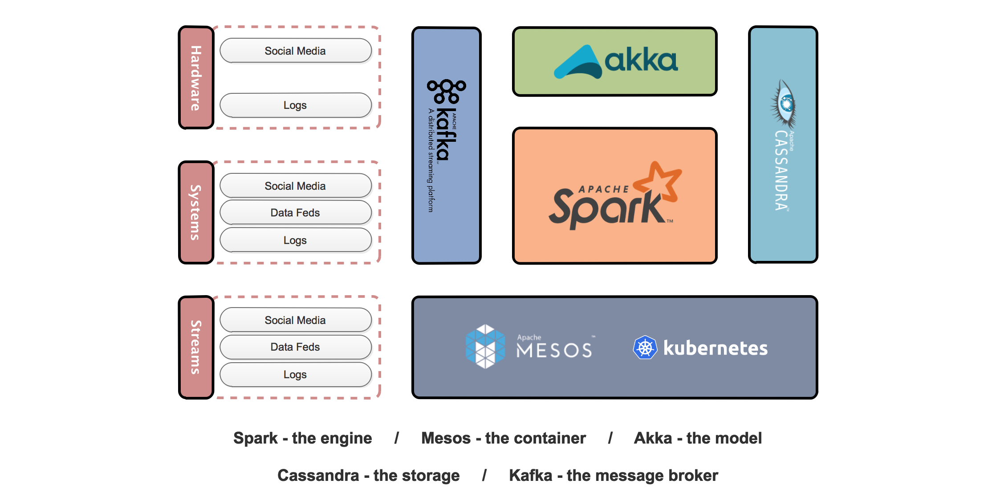
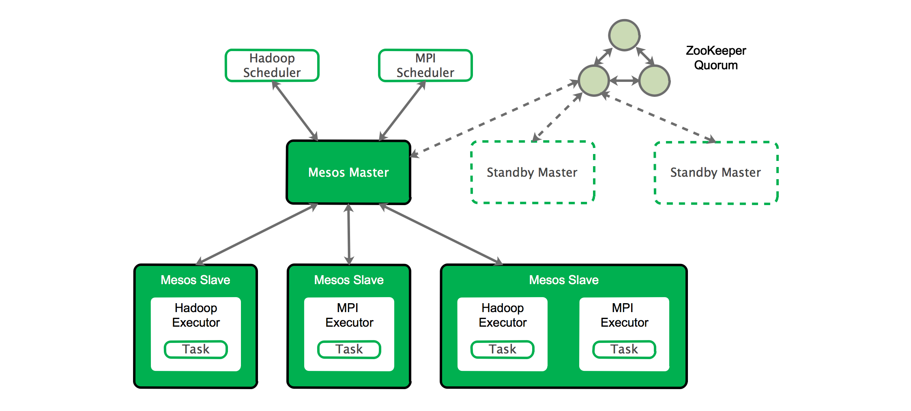
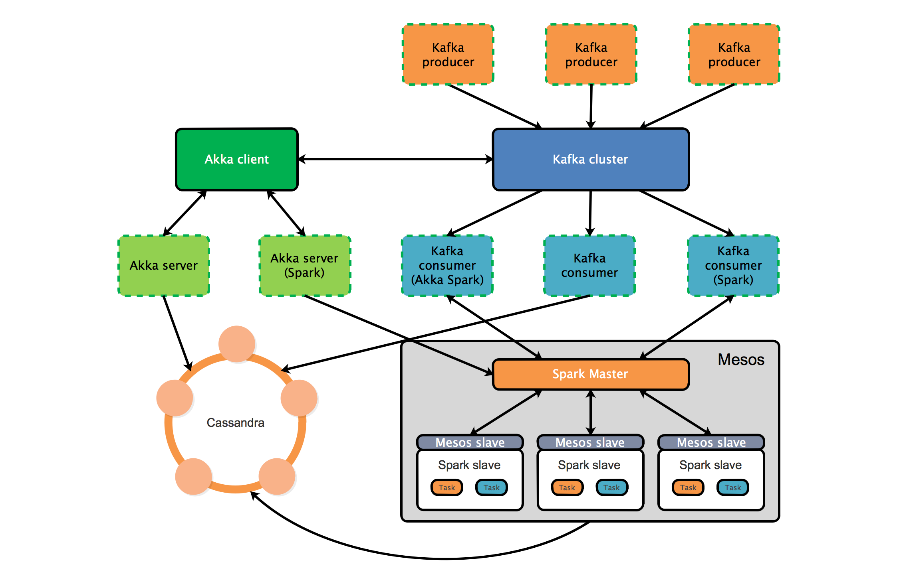

# [云框架]SMACK大数据架构

跟硅谷大数据工程师谈笑风声？Spark、Storm、Pig、Hive……还是Hadoop？那些使用大数据技术的前沿公司会告诉你——**SMACK** is the new buzzword！

SMACK不是一项单一的技术，而是由Spark、Mesos、Akka、Cassandra、Kafka组成的大数据架构，适用于广泛的数据处理场景，可完成低延迟扩展及数据复制、统一管理异构负载集群，并通过单一平台满足不同架构设计和不同应用的需求。（[A Brief History of the SMACK Stack](https://chiefscientist.org/a-brief-history-of-the-smack-stack-f382547e91fe)）

SMACK并不像看上去那样，只是由几部分组成的一套堆栈那么简单，它可以实现大量不同系统设计，包括纯粹的批量或流处理机制，乃至复杂的Lambda及Kappa架构实现。在面对数据源数量急剧增加、数据样本获取难度升高、数据分析时效性差、数据分析投资回报率低等一系列大数据带来的挑战时，SMACK可以解决Hadoop等我们熟知的大数据技术无法解决的诸多问题，特别是物联网化、API化趋势下big data向[fast data](http://www.infoworld.com/article/2608040/big-data/fast-data--the-next-step-after-big-data.html)转变所带来的一系列新需求。

本篇[云框架](README.md)将以海量网站数据为例，提供SMACK大数据框架的最佳实践，包括数据接入、SMACK核心、数据分析等一系列完整框架内容。

# 内容概览

* [快速部署](#快速部署)
* [框架说明-业务](#框架说明-业务)
* [框架说明-MACK核心](#smack核心)
    * [引擎-Spark](#引擎-spark)
    * [容器-Mesos](#容器-mesos)
    * [模型-Akka](#模型-akka)
    * [存储-Cassandra](#存储-cassandra)
    * [消息队列-Kafka](#消息队列-kafka)
    * [数据管道](#数据管道)
* [框架说明-数据接入](#数据接入)
* [框架说明-数据分析与监控](#数据分析与监控)
* [如何变成自己的项目](#如何变成自己的项目)
* [更新计划](#更新计划)
* [社群贡献](#社群贡献)

# 快速部署 @ELVIS2002

# 框架说明-业务 @ELVIS2002

# 框架说明-SMACK核心

如前文所述，SMACK是由`Spark`、`Mesos`、`Akka`、`Cassandra`、`Kafka`组成的大数据架构，其中：

* **S代表Spark** - 分布式大规模数据处理引擎
* **M代表Mesos** - 为分布式应用提供资源隔离和共享的集群资源管理系统
* **A代表Akka** - 在JVM上构建高并发、分布式、弹性消息驱动应用的工具包和运行时（runtime）
* **C代表Cassandra** - 跨数据中心处理大量数据的分布式、高可用数据库
* **K代表Kafka** - 高吞吐量、低延迟、处理实时数据的分布式消息系统

整体结构如下:

Spark是SMACK中最重要的部分，采用[Scala](https://www.scala-lang.org/)语言编写，因此想要玩转SMACK，学会Scala语言非常重要。除此之外，SMACK还会涉及到Java、Python以及R语言等。

* [Scala Documentation](https://www.scala-lang.org/documentation/)
* [Scala Tutorials](https://www.tutorialspoint.com/scala/)

**需要注意的是，Spark、Mesos、Akka、Cassandra、Kafka比较复杂，本项目不做详细解读，仅对基本要点进行介绍以便理解SMACK大数据架构，更多内容建议通过官方文档进行具体学习。**

## 引擎-Spark

Spark基于内存设计，采用分布式计算Master-Slave模型，支持包括Scala、Java、Python在内的多种语言，提供Map Reduce操作、SQL查询、流数据、机器学习和图表数据处理等多种能力。Spark并不是要取代Hadoop，二是为管理不同性质大数据用例的统一框架。

完整的Spark架构生态由Spark Core（核心API）及Spark SQL、Spark Streaming、Spark MLib、Spark Graphx等附加库构成。

**Spark Core**：Spark Core是大规模并行和分布式数据处理的基础引擎（Spark项目基础），负责内存管理和故障恢复、调度分发监控集群作业、与存储系统进行交互等。Spark采用RDD基础数据结构，可通过在外部存储系统中引用数据集（[Actions](http://spark.apache.org/docs/1.2.1/programming-guide.html#actions)）或通过在现有RDD转换（map、filter、reducer、join等）来创建（[Transformations](http://spark.apache.org/docs/1.2.1/programming-guide.html#transformations)）。

**Spark SQL**：Spark SQL通过JDBC API暴露Spark数据集，支持传统BI和可视化工具在Spark数据上执行SQL查询，同时对不同格式数据（JSON、Parquet、数据库等）执行ETL病暴露给特定查询。

**Spark Streaming**：Spark Streaming以微批量的方式计算和处理实时数据流，它使用DStream，简单来说就是一个弹性分布式数据集（RDD）系列，处理实时数据。

**Spark MLib**：Spark MLib（Machine Learning Library）是Spark可扩展的机器学习库，由二元分类、线性回归、聚类、协同过滤、梯度下降以及底层优化原语通用的学习算法和工具组成。

**Spark GraphX**：GraphX是用于图计算和并行图计算的Spark API，通过弹性分布式属性图（Resilient Distributed Property Graph）扩展Spark RDD。GraphX通过暴露基础操作符集合（如subgraph，joinVertices和aggregateMessages）和经过优化的Pregel API变体以支持图计算，并提供简化图分析任务的图算法和构建器集合。

**Read more [Apache Spark Official Documentation](https://spark.apache.org/docs/latest/)**

## 容器-Mesos

集群管理平台Mesos是一种分布式操作系统内核，总体架构由Mesos-master、Mesos-slave（即Mesos-agent）、frameworks（即Mesos applications）及executor组成。

* **Mesos-master**是整个架构的核心，管理接入Mesos的slave和Framework，并按照策略为framework分配slave上的资源。

* **Mesos-slave**接收并执行Mesos-master命令、管理节点上的Mesos-task并为task分配资源。该过程为：Mesos-slave将自身资源量（CPU及内存）发送给Mesos-master，由Mesos-master Allocator模块决定资源分配给哪个framework。用户提交作业时指定每个任务所需CPU个数及内存量，Mesos-slave即可将任务放至包含固定资源的容器中运行，并达到资源隔离的效果。

* **Framework**指Hadoop等外部计算框架。计算框架通过注册方式接入Mesos，并由Mesos统一管理和分配资源。Mmesos采用双层调度框架，第一层为Mesos将资源分配给Framework，第二层为Framework利用自己的调度器模块将资源分配给Framework内部的任务。

* Mesos支持C++、Java、Python三种语言编写的Framework调度器模块，而其内部采用C++实现调度器驱动（Mesos Scheduler Driver），Framework的调度器可调用该driver中的接口与Mesos-master交互，完成注册、资源分配等功能。

* **Executor**用于启动Framework内部task。新Framework接入Mesos时，我们需要编写对应Executor告诉Mesos如何启动该Framework内的task。与调度器类似，Mesos采用C++实现执行器驱动（Mesos Executor Driver）以便Framework告知Mesos如何启动task。

**[Apache Aurora](http://aurora.apache.org/documentation/latest/)**：是执行长期运行服务、cron作业、ad-hoc作业的Mesos框架。Aurora支持自动更新与回滚、资源分配和多用户支持、复杂DSL、服务注册等功能特性。

**[Chronos](https://mesos.github.io/chronos/)**：Chronos是用于执行基于容器定时任务的Mesos框架。Chronos以[ISO 8601](https://en.wikipedia.org/wiki/ISO_8601)时间规范作为定时任务的执行时间配置，任务可选Docker或Mesos两种执行容器形式，支持重叠并发及任务依赖配置。

**[Marathon](https://mesosphere.github.io/marathon/docs/)**:是用于执行长时间运行任务的Mesos框架，如web应用和服务等。Marathon可用于集群的多进程管理、为部署提供REST API服务、SSL与基础认证、配置约束、HAProxy、DNS实现服务发现和负载均衡、Health Check以及可定制化监控策略实现Task自动伸缩等。Marathon常与Mesos和Chronos一起运行，使Chronos可以在Mesos内部运行，并直接管理Chronos及长期运行的web应用和服务。

**[Kubernetes on Mesos](https://kubernetes.io/docs/getting-started-guides/mesos/)**：Mesos允许Kubernetes动态分享集群资源，当Kubernetes运行在Mesos上（相当于一个Framework），你可以轻松将Kubernetes上运行的任务在任意云平台之间转移。

**[Mesos Docker Containerizer](http://mesos.apache.org/documentation/latest/docker-containerizer/)**将Docker迁入Mesos集群可解决去烧故障监控、资源的调度、故障转移平台、缺少user-friendly管理界面和相对完整API、网络管理不够完善等Docker在生产环境中的部分不足。

**Read more [Mesos Official Documentation](http://mesos.apache.org/documentation/latest/)**

## 模型-Akka

Akka是基于Actor模型的并发框架，能够在JVM上简化并行和分布式应用的构建，具有很强的扩展性，可以在系统内轻松创建数千个实例，也能够便捷的从单一节点进程扩展到一个集群的机器中，无需修改代码即可远程运行失败恢复和错误处理。简单来说，Akka是用来开发容错、分布式、并发应用的框架。

Actor是Akka的核心所在，指封装状态和行为的对象，通过交换消息来通讯（不涉及共享内存），由Erlang语言编写，是面向对象编程最严格的形式。

**Actors层次结构**：Actor自然形成层次结构，负责某一功能的Actor会将任务拆解成更小的任务（子Actor），并委托唯一的监管者（supervisor）来监督，直到任务小到可以被完整处理（每一个Actor都是其子Actor的监管者）。这样一来任务本身结构被清晰拆解，同时在Actor无法处理某一任务或状况时，会向监管者发送失败消息以寻求帮助，使失败能够在正确的层次得到处理。

**异步消息（数据）传递**：Akka中消息传递方式分为Fire and Forget和Send and Receive，两种模式均为异步消息模式，即消息一旦发送，方法立刻返回，不会阻塞主线程。

**容错**：Akka中每一个Actor都是其子Actor的监管者，每一个Actor都定义了故障处理监管策略。策略为Actor系统结构的一部分，可以自己定制，但定制后不能修改。

**监管与监控**：在Actor系统中，监管描述actor之间的依赖关系，即监管者（Actor）将任务委托给下属（子Actor）并响应下属失败状况。基于所监管的工作的性质和失败的性质，监管者参考函数配置可以恢复（保持下属当前内部状态）、重启（清楚下属内部状态）、停止、升级（向上级传递失败状况）。需要注意的是，应始终把Actor视为整个系统中的一部分，即以上前三种操作会同时对Actor所有子Actor生效。

**自适应与预测**：Actor模型是一个具有自适应和初步智能的软件智能体（Agent）模型，Actor集群则是软件多智能体（Multi-Agent）。将Actor的功能进一步扩充可形成适用于各种业务的自主，协同和学习的分布式多智能体系统。

**并行化**：

**负载均衡**：

**Read more [Akka Offical Documentation](http://akka.io/docs/)**

## 存储-Cassandra

Cassandra是一个分布式的NoSQL数据库，它最大的特点就是完全去中心化，不像MySQL、MongoDB主从备份的模式，也不像HBase、HDFS有不同类型的节点。整个Cassandra集群就是一个由P2P协议组织起来的网络，消除了所有的单点故障。总体来说，Cassandra具备以下特点：

* 数据处理速度快且具备可扩展性

* 支持多数据中心，没有单点故障

* 多接点故障时仍然可用

* 简单高效便捷的操作

* 数据建模非常灵活

* 支持自动和可配置的复制

* 适合实时摄入数据

* 强大的社区支持

**Read more [Cassandra Official Documentation](http://cassandra.apache.org/doc/latest/)**

## 消息队列-Kafka

Kafka是一款分布式消息系统（基于发布／订阅），因其水平可扩展性及高吞吐率而被广泛采用，具备以下特点：

* 支持自动代理故障切换

* 高性能分布式消息传递

* 可在群集节点之间进行分区和分发

* 数据管线去耦

* 大量消费者得到支持

* 大量的数据加载处理

**Read more [Kafka Official Documentation](https://kafka.apache.org/documentation.html)**

## 数据管道 @ELVIS2002

基于Spark Mesos Akka Cassandra Kafka这样的组合(SMACK），利用其成熟的技术去对应不同场景。更关键在于他们的易用和自由组合，自动化程度高。基于它构建一个平台，灵活性很难被击败。

* Spark and Cassandra

* Akka and Kafka

* Akka and Cassandra

* Akka and Spark

* Kafka and Cassandra

# 数据接入 @ELVIS2002

# 数据分析与监控 @ELVIS2002

# 如何变成自己的项目 @ELVIS2002

# 更新计划

* `文档` 
* `CODE` 

# 社群贡献

+ QQ群: 614186010
+ [参与贡献](CONTRIBUTING.md)
+ [联系我们](mailto:info@goodrain.com)

---- 

[云框架](ABOUT.md)系列主题，遵循[APACHE LICENSE 2.0](LICENSE.md)协议发布。

