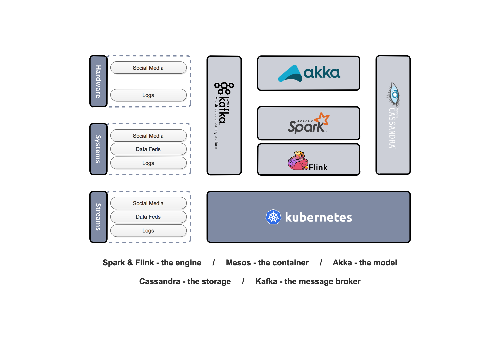

# [云框架]SMACK大数据架构


[](CONTRIBUTORS.md)


跟硅谷大数据工程师谈笑风声？Spark、Storm、Pig、Hive……还是Hadoop？大数据技术前沿公司会告诉你——**SMACK** is the new buzzword！SMACK并非单一技术，而是由Spark、Mesos、Akka、Cassandra、Kafka组成的大数据架构，适用于广泛的数据处理场景，可完成低延迟扩展及数据复制、统一管理异构负载集群，并通过单一平台满足不同架构设计和不同应用的需求。（[A Brief History of the SMACK Stack](https://chiefscientist.org/a-brief-history-of-the-smack-stack-f382547e91fe)）

在面对数据源数量急剧增加、数据样本获取难度升高、数据分析时效性差、数据分析投资回报率低等一系列挑战时，SMACK可以解决Hadoop等熟知技术无法解决的诸多问题，特别是物联网化、API化趋势下big data向[fast data](http://www.infoworld.com/article/2608040/big-data/fast-data--the-next-step-after-big-data.html)转变所带来的新需求，以及对于[Data Pipeline](http://www.toadworld.com/platforms/oracle/w/wiki/11576.modern-data-pipeline-architectures)的依赖。

更深入的讲，SMACK可以看作是一种广义上的框架组合思想，其中技术可以增加或被更适合的技术替代，以便我们更好的完成大数据处理。本篇[云框架](README.md)即在引擎层增加了**Flink用于处理实时数据**，并**使用Kubernetes替换Mesos作为容器层**，以某网站数据为例，提供SMACK大数据框架的最佳实践，包括数据接入、SMACK核心、数据分析等一整套框架内容。

**在学习和使用SMACK业务和框架之前，建议先行了解Fast Data、Data Pipeline、Lambda Architecture等相关[背景说明](./READMORE/background-knowledge.md)，这三点可以说是SMACK的灵魂，也是选择使用SMACK的重要原因。**

# 内容概览

* [快速部署](#快速部署)
* [框架说明-业务](#框架说明-业务)
* [框架说明-组件](#框架说明-组件)
    * [SMACK](#smack)
    * [数据接入](#数据接入)
    * [数据展示](#数据展示)
* [更新计划](#更新计划)
* [社群贡献](#社群贡献)

# <a name="快速部署"></a>快速部署

1. [准备Docker环境](https://github.com/cloudframeworks-smack/user-guide-smack/blob/master/READMORE/install%20docker.md)

2. 克隆完整代码

   ```
   git clone https://github.com/cloudframeworks-smack/user-guide-smack.git
   ```
   
3. 使用[docker-compose](https://docs.docker.com/compose/install/)运行如下命令（[docker-compose.yml](https://github.com/cloudframeworks-smack/user-guide-smack/blob/master/docker-compose.yml)）

   ```
   docker-compose -f docker-compose.yml up -d
   ```

4. 访问路径

    | 访问 | 路径 | 方法 | 参数 |
    | --- | --- | --- | --- |
    | 最近10条日志 | http://DOCKER_HOST:9091/msg/data/nginx_log/test/test/1/10 | Get |  |
    | 最新状态统计信息 | http://DOCKER_HOST:9091/msg/data/status_real_statics/test/test/1/10 | Get |  |
    | 最新请求统计信息 | http://DOCKER_HOST:9091/msg/data/request_real_statics/test/test/1/10 | Get |  |
    | 历史统计信息 | http://DOCKER_HOST:9090/msg/push/statics | Post | 见Post请求参数 |

5. POST请求参数

    ```
        namespace:test
        serviceName:test
        start_time:2017-06-01 01:00:18
        end_time:2017-07-22 01:25:10
        cmd:uv|pv|avgtime
        time_type:day|hour|minute
    ```

# <a name="框架说明-业务"></a>框架说明-业务

某网站需对其nginx日志进行实时数据和历史数据进行分析统计，**实时数据**包括——

* 过去15s中的请求数及每个请求的平均响应时间
* 过去15s中各网站访问状态（3xx、4xx、5xx）出现频率
* 过去某时间段中网站访问PV（天／小时／分钟统计）

**历史数据**包括——

* 过去某时间段中网站访问UV（以IP地址进行唯一性判断，天／小时／分钟统计）
* 过去某时间段中请求总数、总时间、最大响应时间、最小响应时间（天／小时／分钟统计）

其业务架构如下图所示：

<div align=center></div>

# <a name="框架说明-组件"></a>框架说明-组件

## <a name="smack"></a>框架说明-SMACK

本项目中SMACK用到了Spark、Flink、Kubernetes、Akka、Cassandra、Kafka，这一组合在技术成熟度、易用性、组合自由性、自动化程度上极具优势。对于数据的实时处理能力是该组合取代Hadoop的重要原因，在Spark基础上增加Flink而不是完全取代Spark的原因则是，Flink处理数据可达秒级（Spark为分钟级），但Spark在数据批处理成熟度上目前整体要强于Flink。

| 组件 | 功能／任务 | 组件 | 功能／任务 |
| --- | --- | --- | --- |
| File System | nginx日志路径 | Cassandra | 数据持久化 |
| Akka-Http | 数据增强、数据再处理、restful api接口 | Spark | 历史数据批处理 |
| Kafka | 消息队列 | InfluxDb | 实时数据统计后汇总的地方 |
| Flink | 消息流式处理 | Grafana | 整合InfluxDb进行数据展示 |

SMACK整体结构如下:

<div align=center></div>

* File System向用户提供底层数据访问机制，即nigix日志存放目录
* Akka-http从File system加载日志，进行数据增强、数据再处理，并向外部访问提供rest api接口
* 数据通过Akka消息队列处理后，由Kafka执行消息传输
* Flink利用窗口CP机制对数据进行流式处理及实时状态统计
* 经过Flink处理的非统计信息将被存储至Cassandra
* 经过Flink处理的统计信息将被存储至[InfluxDB](https://docs.influxdata.com/influxdb/v1.2/)（用来储存实时数据的数据库）
* Spark从Cassandra获取数据，进行历史数据的批量分析
* 数据通过Grafana（或其他可视化工具）进行展示

**SMACK涉及技术要点概览**

[批处理引擎-Spark](./READMORE/Spark.md)
[实时处理引擎-Flink](./READMORE/Flink.md)
[容器-Kubernetes](./READMORE/Kubernetes.md)
[模型-Akka](./READMORE/Akka.md)
[存储-Cassandra](./READMORE/Cassandra.md)
[消息队列-Kafka](./READMORE/Kafka.md)

## <a name="数据接入"></a>框架说明-数据接入

1. 准备你的访问日志，命名为`log.log`

    使用本项目需对日志格式进行调整，典型日志结构如下所示：

    ```
        172.10.36.32 - - [08/Jun/2017:16:36:46 +0800] "GET /winprize/index?id=aafe-uuawef--afewa HTTP/1.1" 200 2215 "-" "-" "172.11.161.17, 172.10.226.13, 10.208.26.230" 938 0.004 172.11.6.9:10055
        172.10.36.62 - - [08/Jun/2017:16:37:43 +0800] "GET /index HTTP/1.1" 200 56 "-" "-" "172.11.137.181, 172.10.226.14, 10.208.26.226" 947 0.001 172.11.30.144:10055
        172.10.37.46 - - [08/Jun/2017:16:37:43 +0800] "GET /prize/index HTTP/1.1" 200 56 "-" "-" "172.11.97.82, 172.10.226.11, 10.208.26.234" 952 0.001 172.11.6.9:10055
        172.10.36.46 - - [08/Jun/2017:16:37:43 +0800] "GET /prize/rank?r=latest HTTP/1.1" 200 54 "-" "-" "172.11.152.137, 172.10.230.13, 10.208.26.241" 1208 0.001 172.11.9.81:10055
        172.10.37.46 - - [08/Jun/2017:16:36:44 +0800] "GET /prize/rank?r=latest HTTP/1.1" 200 2221 "-" "-" "172.11.97.56, 172.10.226.11, 10.208.26.228" 955 0.003 172.11.14.209:10055
        172.10.36.67 - - [08/Jun/2017:16:36:44 +0800] "GET /index HTTP/1.1" 500 2299 "-" "-" "172.11.152.140, 172.10.230.191, 10.208.26.243" 1024 0.003 172.11.2.194:10055
        172.10.36.32 - - [08/Jun/2017:16:36:46 +0800] "GET /winprize/index?id=aafe-uuawef--afewaaa HTTP/1.1" 404 56 "-" "-" "172.11.161.17, 172.10.230.12, 10.208.26.241" 997 0.001 172.11.23.140:10055
        172.10.36.32 - - [08/Jun/2017:16:37:43 +0800] "GET /prize/index HTTP/1.1" 200 56 "-" "-" "172.10.36.34, 172.10.226.13, 10.208.26.235" 946 0.002 172.11.2.194:10055
        172.10.36.32 - - [08/Jun/2017:16:36:47 +0800] "GET /prize/index HTTP/1.1" 200 56 "-" "-" "172.11.97.88, 172.10.226.13, 10.208.26.229" 1294 0.002 172.11.23.140:10055
    ```

    | 字段 | 表示 | 字段 | 表示 |
    | --- | --- | --- | --- |
    | remoteAddr | -----IP地址 | httpReferer | -----refer |
    | remoteUser | -----用户 | httpUserAgent | -----ua |
    | timeLocal | -----服务时间 | httpXForwardedFor | -----refer |
    | request | -----请求地址 | requestLength | -----请求长度 |
    | status | -----请求状态 | upstreamResponseTime | ------响应时间 |
    | bodySize | ----内容大小 | upstreamAddr | -----响应地址  |

    **[查看实例日志](./exmaple/log.log)**

2. 确保数据格式正确，可通过正则表达式验证

    ```
        reg=`(\d+.\d+.\d+.\d+)\s-\s(.*)\s\[(.+)\]\s\"(.*)\"\s(\d{3,})\s(\d+)\s\"(.*)\"\s\"(.*)\"\s\"(.*?)\"\s(.*)\s(.*)\s(.*)$`
    ```

3. 修改docker-compose.yml文件，找到`akka-instream`并添加

    ```
        volumes:
        - 你本地日志所在目录:/opt/akka/data/
    ```

## <a name="数据展示"></a>框架说明-数据展示

本项目本身并未封装数据展示组件，可使用**Grafana**或接入其他可视化工具，步骤如下：

1. 安装[Grafana](http://docs.grafana.org/)

2. 下载Grafana镜像

    ```
    docker pull grafana/grafana`
    ```

3. 下载Grafana初始化数据（[实例日志](./exmaple/log.log)）到`/tmp`目录并解压，docker启动时需挂载`./exmaple/grafana.tar.gz`目录

4. 执行命令

    ```
    docker run -d -v /tmp/grafana:/var/lib/grafana --publish 3000:3000 grafana/grafana
    ```

5. 登陆访问数据展示界面

    http://DOCKER_HOST:3000/login           ---（默认账号密码：admin/admin）

6. 或直接访问数据展示界面

    http://DOCKER_HOST:3000/dashboard/db/data_statics?refresh=5s&orgId=1

# <a name="更新计划"></a>更新计划

* `CODE` 完善数据展示界面 
* `CODE` 完善集群部署支持

# <a name="社群贡献"></a>社群贡献

+ QQ群: 614186010
+ [参与贡献](CONTRIBUTING.md)
+ [联系我们](mailto:info@goodrain.com)

---- 

[云框架](ABOUT.md)系列主题，遵循[APACHE LICENSE 2.0](LICENSE.md)协议发布。

