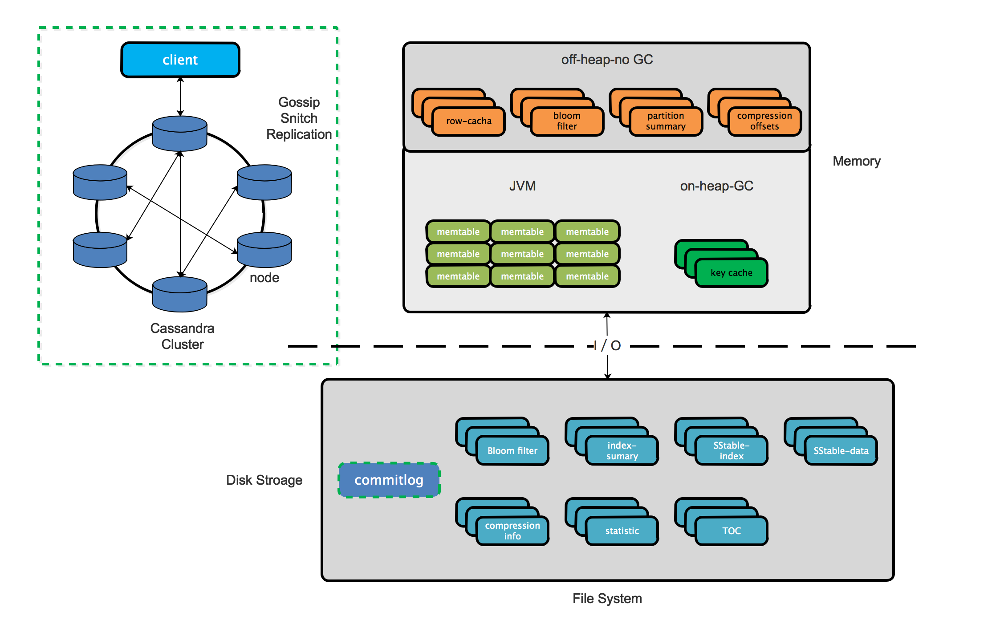

# 存储-Cassandra

Cassandra是一个分布式的NoSQL数据库，它最大的特点就是完全去中心化，不像MySQL、MongoDB主从备份的模式，也不像HBase、HDFS有不同类型的节点。整个Cassandra集群就是一个由P2P协议组织起来的网络，消除了所有的单点故障。

* 数据存储在**node**
* **Data center**为一组配置在一个集群中用于复制和负载隔离的相关节点
* **Cluster**为一组用于存储数据的节点，包含一个或多个数据中心
* **commit log**为cassandra崩溃恢复机制，数据将先写入commit log用于持久化
* **memtable**是存储器驻留的数据结构
* **SStable**是Cassandra周期性写入memtales数据的不变的数据文件，当sstable内容达到阀值时，数据从memtable中刷新
* **bloom filter**用于检索一个元素是否在一个集合中

Cassandra具有以下特性：

* 具备**可扩展性**，允许添加更多硬件以适应大量客户和数据的需求
* 支持多数据中心，**没有单点故障**，且在多节点故障时仍然何用，适合连续用于不能承担故障的关键业务应用
* 线程可扩展（增加集群节点数量以提高吞吐量）以保证**响应时间**
* 数据建模非常灵活，支持结构化、半结构化和非结构化多种数据格式，并且可以**动态适应数据结构变化**
* 支持自动和可配置的数据复制，在需要时灵活**分发数据**
* 可以在低级硬件上执行**快速写入**，在不牺牲读取效率的前提下存储大量数据

**Read more [Cassandra Official Documentation](http://cassandra.apache.org/doc/latest/)**

