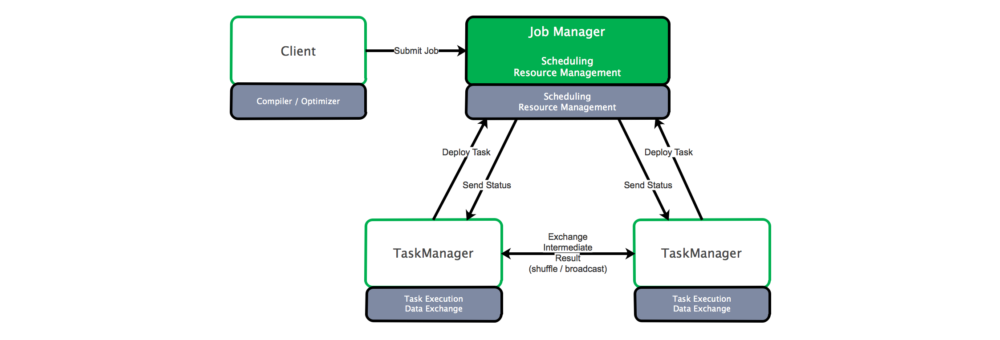
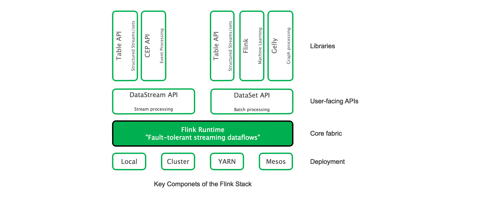

# 引擎-Flink

**使用Flink处理“push型”数据，即实时将数据推送给client**

[Difference between Spark and Flink](https://stackoverflow.com/questions/28082581/what-is-the-difference-between-apache-spark-and-apache-flink)

Flink是针对流数据和批数据（流数据的一种极限特例）的分布式处理引擎，采用Java编写，支持Scala、Java、Python的API。Flink的最大特点在于将所有任务当作“流”来处理，支持快速本地迭代及环形迭代任务。相比Spark，Flink并没有将内存完全交给应用层，由此降低了out of memory的发生（Spark在1.5版本后所有DataFrame操作直接作用于[Tungsten](https://community.hortonworks.com/articles/72502/what-is-tungsten-for-apache-spark.html)的二进制数据上）。

* Client将任务提交给JobManager，JobManager分发任务给TaskManager，TaskManager执行任务并向JobManager汇报任务状态（心跳） 
* TaskManager之间通过“流”来传递数据，TaskManager内部及TaskManager之间均有数据传递
* Flink允许多级Shuffle

Flink具备以下特性：

* 仅需少量配置即可实现高吞吐率和低延迟
* 通过Event Time简化乱序到达事件计算
* 通过checkpoint机制避免故障发生时状态受到影响
* 流式窗口（时间窗口、统计窗口、Session窗口、数据驱动窗口等）可通过灵活的触发条件定制
* Flink streaming运行时，慢的数据sink节点会backpressure快的数据源（sources）
* Flink的容错机制保证了系统在拥有高吞吐率的同时还能提供强一致性的保障
* 流处理和批处理基于同一个运行时（Flink Runtime）
* Flink在JVM实现了自己的内存管理
* Flink支持迭代计算和增量迭代
* [DataStream API](https://ci.apache.org/projects/flink/flink-docs-release-1.2/dev/datastream_api.html) & [DataSet API](https://ci.apache.org/projects/flink/flink-docs-release-1.2/dev/batch/index.html)
* Flink Stack

**Read more [Apache Flink Documentation](https://ci.apache.org/projects/flink/flink-docs-release-1.3/)**

